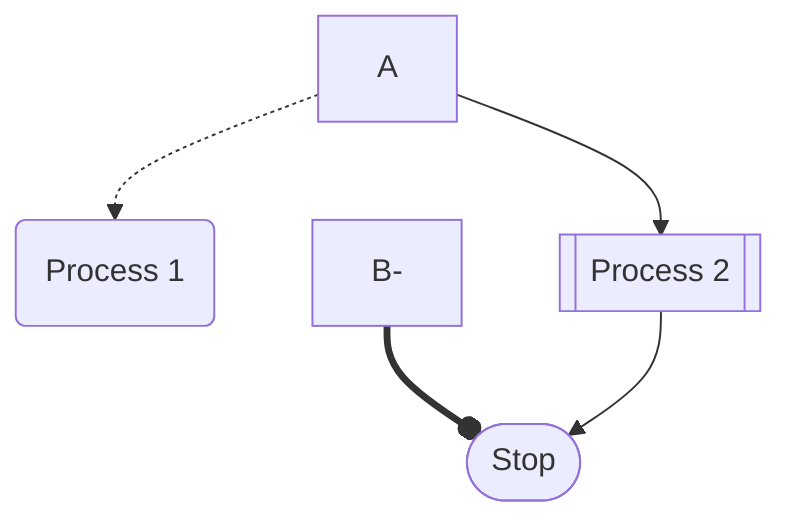
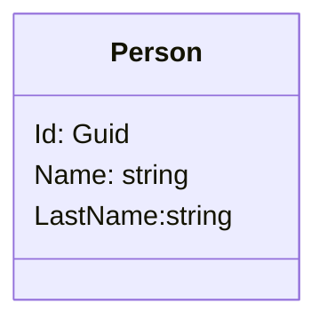
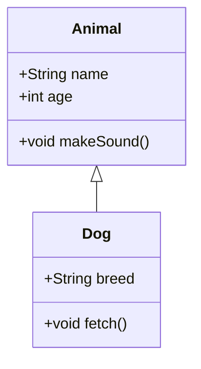
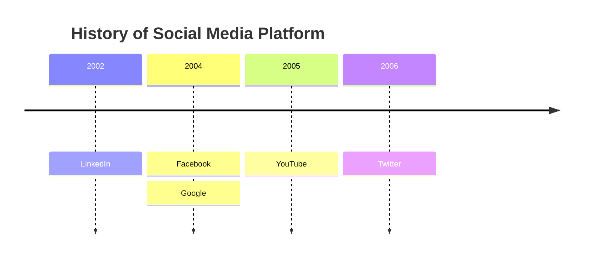
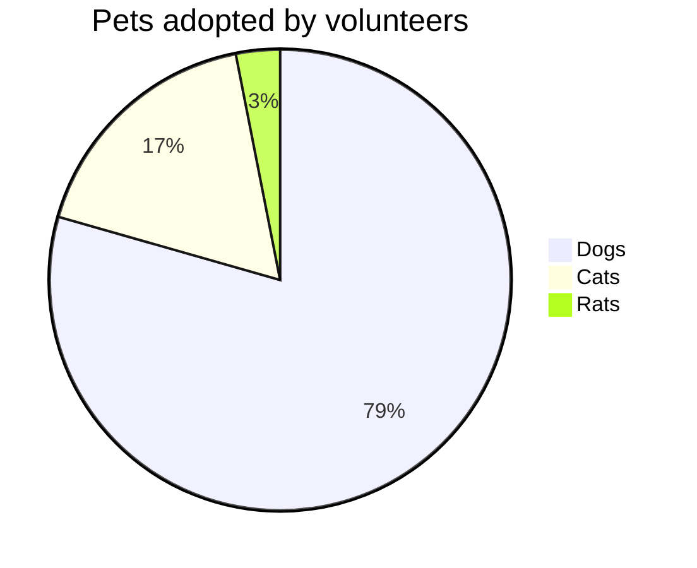

# Diagramming Tool - Mermaid

Recently I came across one diagramming tool in mardown language and how easy it is to draw them like any other HTML script and its even simpler.

Refer [Link for syntax help](https://docs.mermaidchart.com/mermaid-oss/syntax/flowchart.html "Mermaid official")

# Mermaid ExamplesFlowcharts

## Class Diagrams

## Timeline Diagram

## Pie chart 

